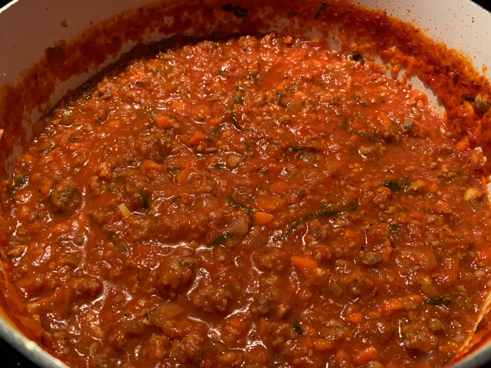

# Ingredients

- 1 lb sweet italian sausage
- 1 onion, diced
- 2 celery, diced
- 2 carrot, diced
- 2 cloves garlic, minced
- 1 28 oz can crushed tomatoes
- 1 tsp dried basil
- t tsp dried oregano
- 1/2 tsp fennel seed, crushed
- 4 tbsp fresh italian parsley, chopped

# Directions

1. Brown sausage
2. Add mirepoix, sautee
3. Add garlic, sautee until fragrant
4. Add crushed tomatoes, add dried herbs, bring to boil, drop to simmer for at least an hour
5. Add fresh parsley 20 minutes before serving
